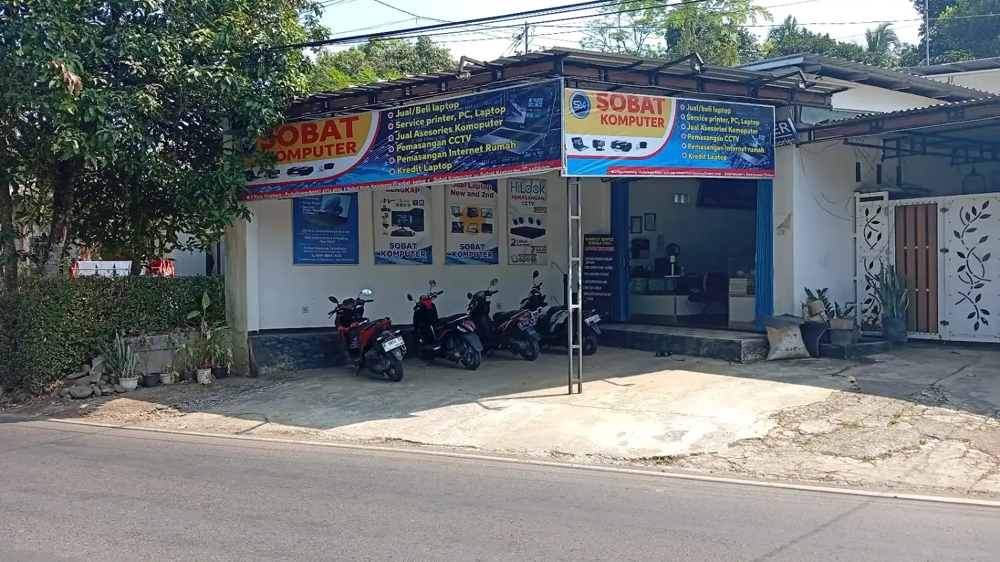

<p align="center">
  <a href="https://sobatkomputer.github.io/">
    
  </a>
</p>

<h1 align="center">Website New Sobat Komputer</h1>

<p align="center">
  Website resmi New Sobat Komputer di Kejobong, Purbalingga.
</p>

<p align="center">
  <a href="https://sobatkomputer.github.io/">
    
  </a>
  <br><br>
  
  
  
  <br>
  
  
  
  
</p>

---

## Tentang Website

Ini adalah repository untuk website publik **New Sobat Komputer**, toko dan layanan komputer yang berada di Kejobong, Kabupaten Purbalingga.

Website ini berisi informasi yang biasanya dibutuhkan pelanggan sebelum datang atau menghubungi toko, mulai dari daftar layanan, produk, promo, alamat, jam buka, sampai kontak WhatsApp.

Website dapat dibuka melalui:

**[https://sobatkomputer.github.io/](https://sobatkomputer.github.io/)**

<p align="center">
  <a href="https://sobatkomputer.github.io/">
    
  </a>
</p>

## Isi Website

Beberapa informasi yang tersedia di website:

- Servis laptop dan komputer.
- Servis printer.
- Upgrade RAM dan SSD.
- Instalasi Windows, Office, dan aplikasi.
- Pembersihan perangkat dan penggantian thermal paste.
- Penanganan laptop atau komputer lemot, blue screen, dan mati total.
- Pemasangan CCTV.
- Pemasangan dan perbaikan jaringan.
- Internet fiber rumah.
- Jual beli laptop dan komputer.
- Penjualan aksesori komputer.
- Produk dan promo terbaru.
- Alamat toko, jam buka, Google Maps, dan kontak WhatsApp.

## Fitur

- Tampilan menyesuaikan desktop, tablet, dan perangkat mobile.
- Menu hamburger untuk tampilan mobile.
- Gambar hero yang berbeda untuk desktop dan mobile.
- Halaman khusus layanan, produk, promo, dan kontak.
- Daftar produk laptop dan aksesori.
- Carousel promo dengan tombol navigasi dan indikator.
- Swipe carousel pada perangkat mobile.
- Tombol WhatsApp di beberapa bagian penting.
- Link Google Maps, Facebook, dan Instagram.
- Tombol kembali ke atas.
- Lazy loading pada gambar.
- Navigasi keyboard.
- Dukungan `prefers-reduced-motion`.
- Metadata SEO dan structured data.
- `robots.txt`, `sitemap.xml`, dan halaman 404 khusus.

## Halaman

| Halaman | File | Keterangan |
|---|---|---|
| Beranda | `index.html` | Ringkasan toko, layanan, produk, dan lokasi |
| Layanan | `layanan.html` | Daftar layanan New Sobat Komputer |
| Produk | `produk.html` | Poster laptop dan aksesori |
| Promo | `promo.html` | Daftar promo dalam bentuk carousel |
| Kontak | `kontak.html` | Alamat, jam buka, peta, dan kontak |
| Halaman 404 | `404.html` | Ditampilkan ketika halaman tidak ditemukan |

## Teknologi yang Digunakan

Website ini dibuat tanpa framework dan tidak membutuhkan proses build khusus.

### HTML

Digunakan untuk struktur halaman, isi website, navigasi, metadata, dan structured data.

### CSS

Seluruh tampilan utama berada di:

```text
assets/css/style.css
```

File ini mengatur layout, responsive breakpoint, komponen, animasi, carousel, product rail, tombol, dan tampilan halaman 404.

### JavaScript

JavaScript digunakan untuk bagian interaktif, seperti:

- Menu mobile.
- Carousel promo.
- Product rail.
- Hero responsif.
- Tombol kembali ke atas.
- Pembuatan link WhatsApp.
- Pengelolaan data promo.

Sebagian JavaScript memakai ES Modules agar file lebih terpisah dan mudah dirawat.

### GitHub Pages

Website dipublikasikan melalui GitHub Pages dan dapat dibuka langsung melalui:

**[https://sobatkomputer.github.io/](https://sobatkomputer.github.io/)**

### Font

Website menggunakan **Plus Jakarta Sans** dari Google Fonts.

## Struktur Repository

```text
website-sobat-komputer/
├── index.html
├── layanan.html
├── produk.html
├── promo.html
├── kontak.html
├── 404.html
├── robots.txt
├── sitemap.xml
├── .nojekyll
├── assets/
│   ├── css/
│   │   └── style.css
│   ├── js/
│   │   ├── core/
│   │   ├── data/
│   │   ├── public/
│   │   └── main.js
│   └── images/
│       ├── brand/
│       ├── hero/
│       ├── layanan/
│       ├── produk_laptop/
│       ├── produk_aksesori/
│       └── promotions/
└── README.md
```

### `assets/css`

Berisi file CSS utama website.

```text
assets/css/style.css
```

### `assets/js`

Berisi file JavaScript untuk menu, hero, produk, promo, WhatsApp, dan interaksi lainnya.

| Folder atau file | Isi |
|---|---|
| `core/` | Kontak, WhatsApp, dan akses data |
| `data/` | Data hero dan promo |
| `public/` | Komponen hero, carousel, produk, dan promo |
| `main.js` | Interaksi umum di seluruh halaman |

### `assets/images`

Semua gambar website disimpan di folder ini dan dipisahkan sesuai kegunaannya.

| Folder | Isi |
|---|---|
| `brand/` | Logo dan favicon |
| `hero/` | Gambar hero desktop dan mobile |
| `layanan/` | Poster dan gambar layanan |
| `produk_laptop/` | Poster produk laptop |
| `produk_aksesori/` | Poster produk aksesori |
| `promotions/` | Poster promo |

## Menjalankan Website di Komputer

Clone repository:

```bash
git clone https://github.com/alfa-reza/website-sobat-komputer.git
cd website-sobat-komputer
```

Jalankan server lokal menggunakan Python:

```bash
python3 -m http.server 8000
```

Untuk Windows:

```powershell
py -m http.server 8000
```

Kemudian buka:

```text
http://localhost:8000
```

Bisa juga memakai ekstensi **Live Server** di Visual Studio Code.

Server lokal disarankan karena beberapa bagian JavaScript menggunakan ES Modules.

## Mengganti Gambar

Semua gambar berada di:

```text
assets/images/
```

Cara paling mudah untuk mengganti gambar adalah menimpa file lama dengan file baru menggunakan:

- Nama file yang sama.
- Folder yang sama.
- Rasio yang sama.
- Format `.webp`.

Contoh:

```text
assets/images/promotions/promo-1.webp
```

Selama nama dan lokasinya tidak berubah, gambar dapat diganti tanpa mengubah HTML atau JavaScript.

## Format dan Ukuran Gambar

Semua gambar konten menggunakan format:

```text
.webp
```

WebP dipakai agar ukuran file lebih ringan tanpa membuat gambar terlihat pecah.

| Jenis gambar | Lokasi | Rasio | Ukuran |
|---|---|---:|---:|
| Logo | `assets/images/brand/logo.webp` | 1:1 | 512 × 512 px |
| Hero desktop | `assets/images/hero/*desktop*.webp` | 16:9 | 1536 × 864 px |
| Hero mobile | `assets/images/hero/*mobile*.webp` | 4:5 | 864 × 1080 px |
| Poster utama layanan | `assets/images/layanan/poster.layanan.webp` | 4:5 | 1080 × 1350 px |
| Gambar layanan | `assets/images/layanan/*.webp` | 4:3 | 800 × 600 px |
| Poster laptop | `assets/images/produk_laptop/*.webp` | 4:5 | 960 × 1200 px |
| Poster aksesori | `assets/images/produk_aksesori/*.webp` | 4:5 | 960 × 1200 px |
| Poster promo | `assets/images/promotions/*.webp` | 4:5 | 1080 × 1350 px |

Favicon saat ini tetap menggunakan PNG:

```text
assets/images/brand/favicon.png
```

### Aturan Gambar

- Gunakan format `.webp` untuk gambar konten.
- Gunakan color profile sRGB.
- Pertahankan rasio sesuai tabel.
- Jangan meletakkan tulisan terlalu dekat dengan tepi gambar.
- Pastikan tulisan pada poster masih mudah dibaca.
- Kompres gambar secukupnya agar ukuran file tidak terlalu besar.
- Gunakan nama file huruf kecil.
- Hindari spasi pada nama file.
- Gunakan tanda hubung `-` atau garis bawah `_` jika diperlukan.
- Gunakan alt text yang sesuai dengan isi gambar.

Untuk poster berukuran 1080 × 1350 px, sisakan jarak aman sekitar 60–80 px dari tepi gambar.

## Gambar Hero

Gambar hero yang digunakan website:

```text
assets/images/hero/new-sobat-komputer-hero-desktop-1536x864.webp
assets/images/hero/new-sobat-komputer-hero-mobile-864x1080.webp
```

File desktop digunakan pada layar lebar, sedangkan file mobile digunakan pada layar yang lebih kecil.

Saat mengganti gambar hero, sebaiknya tetap gunakan nama file yang sama.

## Gambar Layanan

Folder gambar layanan:

```text
assets/images/layanan/
```

Isi folder saat ini:

```text
aksesori.webp
cctv.webp
jaringan.webp
jual-beli.webp
poster.layanan.webp
servis-komputer.webp
servis-printer.webp
```

Ukuran yang digunakan:

- `poster.layanan.webp` memakai rasio 4:5.
- Gambar layanan lainnya memakai rasio 4:3.

## Gambar Produk

Poster produk dipisahkan menjadi dua folder:

```text
assets/images/produk_laptop/
assets/images/produk_aksesori/
```

Saat ini tersedia:

- 15 slot poster laptop.
- 15 slot poster aksesori.

Pola nama file laptop:

```text
laptop_1.webp
laptop_2.webp
...
laptop_15.webp
```

Pola nama file aksesori:

```text
aksesori_1.webp
aksesori_2.webp
...
aksesori_15.webp
```

Poster dapat diganti mengikuti produk atau stok terbaru selama nama file tetap sama.

Jika jumlah poster ditambah atau dikurangi, daftar produk di `produk.html` juga perlu disesuaikan.

## Gambar Promo

Folder poster promo:

```text
assets/images/promotions/
```

Saat ini tersedia delapan slot:

```text
promo-1.webp
promo-2.webp
promo-3.webp
promo-4.webp
promo-5.webp
promo-6.webp
promo-7.webp
promo-8.webp
```

Semua poster promo memakai rasio 4:5 dengan ukuran 1080 × 1350 px.

Untuk mengganti promo tanpa mengubah susunan carousel, cukup timpa file lama memakai nama file yang sama.

Data urutan dan status promo berada di:

```text
assets/js/data/mock-content.mjs
```

## Mengubah Isi Website

### Beranda

Konten utama beranda berada di:

```text
index.html
```

Di dalamnya terdapat informasi toko, keunggulan, layanan, produk, lokasi, jam buka, dan link sosial media.

### Layanan

Daftar layanan berada di:

```text
layanan.html
```

Gambar pendukungnya berada di:

```text
assets/images/layanan/
```

### Produk

Daftar produk berada di:

```text
produk.html
```

Gambarnya berada di folder produk laptop dan aksesori.

### Promo

Halaman promo berada di:

```text
promo.html
```

Data promo berada di:

```text
assets/js/data/mock-content.mjs
```

### Kontak

Informasi WhatsApp utama berada di:

```text
assets/js/core/contacts.mjs
```

Alamat, jam buka, Google Maps, Facebook, dan Instagram juga muncul di beberapa halaman HTML.

Saat ada perubahan informasi toko, bagian terkait perlu diperbarui agar isinya tetap sama di seluruh website.

## SEO

Website sudah dilengkapi dengan:

- Title dan meta description.
- Canonical URL.
- Robots meta.
- Open Graph.
- Twitter Card.
- Structured data Schema.org.
- Breadcrumb pada halaman internal.
- `robots.txt`.
- `sitemap.xml`.
- Alt text pada gambar.
- Halaman 404 dengan `noindex`.

Canonical URL dan sitemap menggunakan:

```text
https://sobatkomputer.github.io/
```

---

<p align="center">
  <a href="https://sobatkomputer.github.io/">
    <strong>Kunjungi Website New Sobat Komputer</strong>
  </a>
</p>
